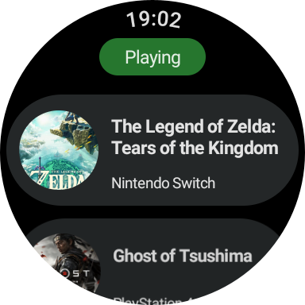
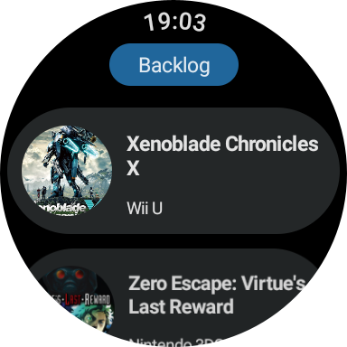
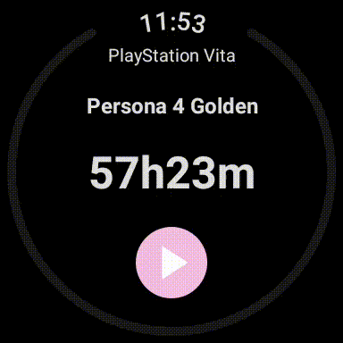
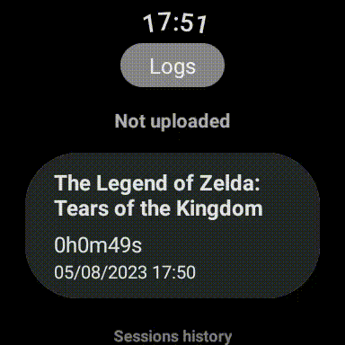

# HLTB-wearOS

⚠️***Current Status*** : WIP

HowLongToBeat on WearOS. 
- Retrieve your HLTB games status by category. 
- Select a game to start a stopwatch and save your timed session at the end of it.
- See an history of your sessions.
- If an error occurs while sending a session to HLTB, a log is saved locally and you wil be able to try sending it later (or upload it manually to HLTB and remove it from the logs).

## Screenshots
### Display games by categories




### Launch a gaming session



### Logs of sessions



## Configuration

The app currently work with a cookie retrieved from the website. To make it work with your account, you need to set te following vars in the `local.properties` file : 
```
USER_COOKIE = hltb_alive=UID=xxxxxx&IN=xxxxxxx&U=xxxxx
USER_ID = 123456
```
