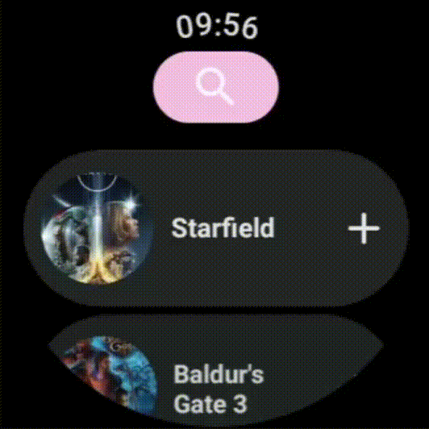
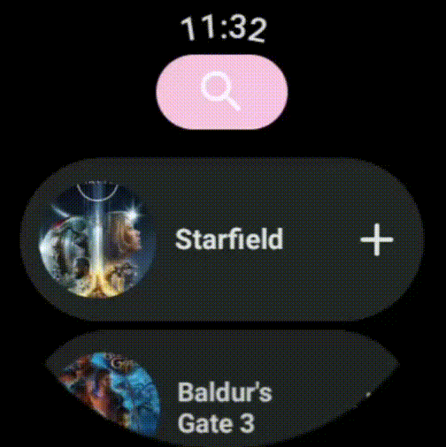

<h1 align="center">HLTB WearOS</h1>

HowLongToBeat but for wearOS

 

Based on the **HLTB website** https://howlongtobeat.com/

HowLongToBeat, but on WearOS.

**Next** :
- Optimize code to improve battery saving.

## Installation

The app is not available through Google Play Store (at least for now).
Here's the steps to follow to get it : 

1. Head over to the release page and download the latest release apks. 
There's one for the actual wearOS app and an another one for the phone app (needed to logged into your HLTB account, it is mandatory to use the wearOS app).
2. Install the phone app `mobile-HLTBwearOS.apk` on your phone. Once installed, the application is purposely not visible on your phone app list. You can find it in the Settings apps list of your phone, searching for "HLTBWearOS".
3. Install the wearOS app `watch-HLTBwearOS.apk` on your watch. Installing an .apk on a wearOS device can be a bit tricky. I personally use the [Wear OS Tools for windows](https://forum.xda-developers.com/attachments/wearos-tools-v10-rar.5927083/) tools to do so.
4. Have fun beating your games !😁

## Features

### Login

### Display games by categories

Retrieve your HLTB games status by category.

### Launch a gaming session

Select a game to start a stopwatch and save your timed session at the end of it.

### Logs of sessions

See an history of your game sessions. 
If an error occurred while sending a session to HLTB, a log is saved locally and you will be able to try sending it from here (or upload it manually to HLTB and remove it from the logs).

### Searching and adding games

Search for a game on HLTB. By default, the search is ordered by most popular games.
You can search a game either by vocal or keyboard input.

Add a game from search view. You can add a game several times, as on the website. If you already have the game
in (at least) one of your list, you'll see a check mark on the game item.

